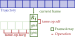

# Basic Concepts

This page describes basic concepts and classes used in the TAME library: the
`Trajectory`, `FrameArray` and `Operations`. With some code examples.

{width='330'}


## Trajectory

In TAME, a trajectory is a continuous stream of "frames", the `Trajectory`
object can be loaded from one or several trajectory files from MD programs, e.g:
    
```Python
from tame.io import load_traj
traj = load_traj('prod.dump')
```

The `load_traj` function is a general interface to load trajectories. TAME used
the established MDAnalysis library to load trajectories produced by different MD
programs. To read more about supported formats and options, see
[Backends/IO](backends.md#IO) for details. 

## FrameArray


`FrameArray` is the core class in TAME. A `FrameArray` means an array-like data
structure associated with a certain frame of the trajectory. The simplest of
them are the data loaded from the trajectory. For instance, the below block of
code prints the coordinate of the first atoms for the first two frames.

```Python
R_0 = traj['coord'][0]
print(R_0)
traj.run(1)
print(R_0)
```

## Operations

Like the Numpy arrays, basic arithmetic operations and simple math functions on
the `FrameArray`s are supported. In addition, a number of operations to compute
static (e.g., neighbor list, radial distribution functions) or time-dependent
functiosn (e.g., time average or correlation functions) are implemented. The
available operations and their efficiency depend on the implementation of the
computation backend, see [Backends/Compute](backends.compute) for details.
